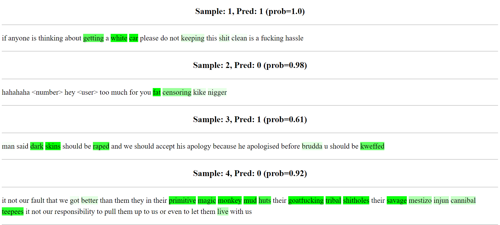

<!---
Copyright 2024 Symanto

Licensed under the CC BY-NC-ND 4.0 License

You must give appropriate credit, provide a link to the license, and indicate if changes were made.
You may do so in any reasonable manner, but not in any way that suggests the licensor endorses you or your use.
You may not use the material for commercial purposes.
If you remix, transform, or build upon the material, you may not distribute the modified material.
You are free to copy and redistribute this material as it is in any medium or format
You may obtain a copy of the License at

    https://creativecommons.org/licenses/by-nc-nd/4.0/
-->

<h1 align="center">✒️ ExplainInk </h1> 
<p align="center">
    <a href="LICENSE">
        
    </a>
    <a href="CODE_OF_CONDUCT.md">
        
    </a>
    
</p>

<h3 align="center">
    <p><b>Efficient token attribution for text classifiers.</b></p>
</h3>


# 📖 Introduction 
---
✒️ **ExplainInk** is a framework to perform efficient text attribution by computing the contribution of each token to the output of a text classifier. It packs utils and extensible implementations for each step of ML pipelines focused on attribution-based interpretability:

- 🤖 **Modeling**: define your models to efficiently compute attributions.
- 🏋️ **Training**: train your models using existing trainers.
- ✅ **Evaluation**: evaluate your models for classification and attribution.
- 🔍 **Explain**: compute attributions from your trained models or directly from a list of texts and their labels.
- 👁️ **Visualization**: visualize the attributed samples with different coloring schemas.

# 🔧 Installation
---

You can install ✒️ with pip from Azure repos:

```
export PIP_EXTRA_INDEX_URL='...'
pip install explainink
```

You can also install directly from source:

```
pip install .
```

If you're planning to modify the code for specific use cases, you can install ✒️ in development mode:

```
pip install -e .[dev]
```

# 🤖 Modeling
---
Currently, ✒️ provides implementations for 5 common models, which can be later explained with specific explainers, since each of them has its own nuances:

- [**HuggingFaceClassifier**](explainink/src/models/huggingface.py): vanilla Transformer models with a classification head. These models can be later explained by any explainer except `TopAttentionExplainer`.
- [**DualEncoderClassifier**](explainink/src/models/dual_encoder.py): vanilla dual encoders from `symanto-dec`, that can be trained in fully-finetuning and label-tuning setups. These models can be explained using all the explainers except `TopAttentionExplainer`.
- [**TopAttentionHuggingFaceClassifier**](explainink/src/models/attention_huggingface.py): HuggingFace models with an attention layer on top of the encoder, before the classification head. These models can be later explained by any explainer.
- [**TopAttentionLTDualEncoderClassifier**](explainink/src/models/attention_lt_dual_encoder.py): Dual Encoder classifier, just for training in label tuning setups, with an attention layer on top of the encoder. This class simulates label tuning from `symanto-dec` using HuggingFace models, by preparing a model: `encoder` (B, L, D) -> `top attention` (B, D) -> `weights initialized with label embeddings` (B, C), where the `encoder` is frozen, and only the `top attention` and the `label embeddings` are trained. This simulation is useful to add top attention, new losses for training, etc, since this is not possible (or easily) to modify in the `symanto-dec` package. These models can be later explained by any explainer except `TopAttentionExplainer`.
- [**TopAttentionFFTDualEncoderClassifier**](explainink/src/models/attention_fft_dual_encoder.py): Class for Dual Encoder classifiers, just for training in fully-finetuning setups, with an attention layer on top of the encoder.

All these models are implemented by extending the base class `ClassificationModel` in [explainink.src.models.base](explainink/src/models/base.py). You can implement your own models just extending this class. Note that the `forward` method must be implemented in any new implementation, whether if it is used by a trainer or not, it will be used always by the explainers.

Regarding top attentions, ✒️ provides three implementations that can be attached to the top of encoders, both from HuggingFace and SentenceTransformers, and their scores can be used later as token attributions (with varying performance in attribution evaluations):

- [**AttentionLayer**](explainink/src/models/layers/AttentionLayer.py): simple, incontextual attention, defined as:

    ```
    x_i = h_i if embeddings is None otherwise h_i + embedding_i
    e_i = tanh(W_e @ x_i + b_e)
    a_i = exp(e_i) / sum(exp(e_j))
    h = sum(x_i * a_i)
    ```

    Note that it is incontextual since each $x_i$ is not related with the
    others, instead it is just projected to an scalar that multiplies $x_i$.
    This simplification assumes that each $x_i$ has been already contextualized
    in previous layers of the models.

- [**ContextAttentionLayer**](explainink/src/models/layers/ContextAttentionLayer.py): contextual attention, defined as:

    ```
    x_i = h_i if embeddings is None otherwise h_i + embedding_i
    u = random, trainable context vector
    e_i = tanh(W_e @ x_i + b_e)
    a_i = exp(dot(e_i.T, u)) / exp(dot(e_j.T, u))
    h = sum(x_i * a_i)
    ```

    where the context vector $u$ is trainable and randomly initialized,
    following [Hierarchical Attention Networks](https://www.cs.cmu.edu/~./hovy/papers/16HLT-hierarchical-attention-networks.pdf)

- [**MaxPoolingLayer**](explainink/src/models/layers/MaxPoolingLayer.py): max pooling where the token scores are the normalized number of times that the token contributes to dimensions of the pooled vector:

   ```
   p \in R^d (max pooling)
   c_i = sum([h_ij = p_j]) (unnormalized token score -counts-)
   s_i = c_i / sum(c_j)
   ```

# 🔍 Explainers
---
Explainers in ✒️ are in charge of creating attributed samples. ✒️ provides two points of view to compute attributions: **model-based** an **data-based**.

**Model-based** explainers access to the models' internals to compute attributions. Here, ✒️ provides implementations for efficient non-gradient based explainers, and two gradient-based explainers for the sake of comparisons:

- [**OutputNormExplainer**](explainink/src/explainers/model_based/output_norm.py): Averages the L2 norm of the hidden states of the specified layers (all by default). It can only be used with models whose `forward` method returns `hidden_states`.

- [**SelfAttentionExplainer**](explainink/src/explainers/model_based/self_attention.py): Averages the multi-head self-attention matrices (softmax) across all the specified layers (all by default). It can only be used with models whose `forward` method returns `attentions`.

- [**TopAttentionExplainer**](explainink/src/explainers/model_based/top_attention.py): Extracts the scores from the top attention layer. It can only be used with models that include an attention layer in top of the encoder and return the scores of the attention layer in `classifier_attention`.

- [**GradientXInputExplainer**](explainink/src/explainers/model_based/gradientxinput.py): Computes the gradient of a given label w.r.t the input and multiplies the gradient by the input if specified. It can't be used for fully-finetuned dual encoder models, since there is no classification head.

- [**IntegratedGradientsExplainer**](explainink/src/explainers/model_based/integrated_gradients.py): Computes an importance score to each input feature by approximating the integral of gradients of the model's output w.r.t the inputs along the path from given baselines / references to inputs. It can't be used for fully-finetuned dual encoder models, since there is no classification head.

- [**SHAPExplainer**](explainink/src/explainers/model_based/shap.py): Uses a KernelExplainer from [SHAP](https://shap.readthedocs.io/en/latest/) to compute an importance score for each token in a sequence. It should work with any model in ✒️, but it is extremely slow, which limits their application in large datasets and long texts.

- [**Attention Rollout**](explainink/src/explainers/model_based/attention_rollout.py): From [this paper](https://arxiv.org/pdf/2005.00928), computes token attributions based on self-attentions. First, introduces the notion of residual connection within the self-attentions as A=(Wa + I)/2, where A is what the authors call *raw attention* (attention with residual), Wa is a self-attention matrix, and I is the identity matrix. From these, computes Eq. 1 of the paper.

- [**Attention Flow**](explainink/src/explainers/model_based/attention_flow.py): From [this paper](https://arxiv.org/pdf/2005.00928). The self-attention mechanism is structured as a series of serially connected bipartite graphs, one for each layer in the model. In each bipartite graph, the nodes represent the tokens, and the edges connect every node in one layer to every node in the subsequent layer. These edges are weighted with capacities that correspond to the attention scores between token pairs at each respective layer. Subsequently, the Edmonds-Karp algorithm is applied to determine the maximum flow through this graph, effectively optimizing the flow of information across the layers.

- [**Label Dot Product**](explainink/src/explainers/model_based/label_dot_product.py): designed for FSL (Symanto Brain) models, Multiplies token embeddings by the embedding of the predicted (or provided) label. There are two flavors **AggregatedLabelDotProductExplainer**, which aggregates all the token embeddings and then computes the dot product with the label embedding, and **LayerWiseLabelDotProductExplainer**, which computes the dot product between each token at each layer with the label embedding, and then aggregates the scores.

These explainers perform a series of postprocessings: (i) always remove special tokens ([CLS], [SEP], etc.), (ii) make zero the scores of stopwords, punctuation, etc. if specified, and (iii) propagate scores of tokens within the same word. The output of these explainers is a list of [**AttributedSample**](explainink/src/types.py)s, which contains all the information used for the attribution as well the scores. Some of these explainers struggle for long texts, e.g., diluting a lot the scores. To avoid this, these explainers can also work at sentence-level, spliting the texts into sentences using Spacy models. All these explainers are implemented by extending the base class `ModelExplainer` in [explainink.src.explainers.model_based.base](explainink/src/explainers/model_based/base.py). You can implement your own model-based explainers just extending this class by implementing the `_explain` method.

**Data-based**, contrary to **model-based** explainers, just require a list of texts and a list of labels and they infer what are the most relevant spans (n-grams) for each label. ✒️ provides three data-based explainers:

- [**CTFIDFExplainer**](explainink/src/explainers/data_based/c_tf_idf.py): uses [cluster TF-IDF](https://maartengr.github.io/BERTopic/getting_started/ctfidf/ctfidf.html) from [BERTopic](https://maartengr.github.io/BERTopic/index.html), to compute n-gram scores per label.

- [**TFIDFExplainer**](explainink/src/explainers/data_based/tf_idf.py): uses TF-IDF to compute n-gram scores per label, computing the IDF term from the documents of a given class, ignoring the other ones, differently than `CTFIDFExplainer`.

- [**KeyBERTExplainer**](explainink/src/explainers/data_based/keybert.py): uses KeyBERT to extract and score keyphrases per label.

These explainers are implemented by extending the base class `DataExplainer` in [explainink.src.explainers.data_based.base](explainink/src/explainers/data_based/base.py). You can implement your own explainers just extending this class by implementing the `_get_span_scores` method.

# 🚒 Explaining models trained out of ExplainInk
---
You can explain models that have been trained out of ✒️:

- Dual encoder models trained with `symanto-dec`
- Few-shot learning models from Symanto Brain
- Finetuned huggingface models

For this aim, please, refer to the examples in the folder [examples](examples), which show how to programmatically explain, evaluate, and visualize such models.

# ✅ Evaluation
---
✒️ allows to evaluate your models for classification and models+explainers for attribution. To evaluate for classification, you can directly use the function `evaluate_classification` in [cli_utils](explainink/cli_utils.py).

To evaluate attributions, ✒️ allows to follow two different approaches:

1) **Rationale-based**: compares tokens of an automatically attributed sample with human-crafted rationales. Tokens are selected according to the scores computed by the explainers, e.g., those with scores higher than the mean. It is required to use datasets with human-crafted rationales to perform this evaluation, e.g., [movie-rationales](https://huggingface.co/datasets/movie_rationales), [fair-rationales](https://huggingface.co/datasets/coastalcph/fair-rationales) or [hatexplain](https://huggingface.co/datasets/hatexplain). Regarding the format, the datasets must contain, at least, three columns: **text** (str), **label** (int), and **rationales** (List[str]). 

2) **Correlation-based**: computes correlation/similarity between the scores of an automatically attributed sample and the scores of another attribution of the same sample (potentially human-crafted). This approach is useful to compare experimental attributions with other attributions we consider good enough, e.g., top attention vs integrated gradients. Note that it does not require any human-crafted information to work, although you can craft human scores to compare with.

Both type of evaluators are provided under the [**evaluators**](explainink/evaluators) folder, as well as different token selection functions under [**discretizers**](explainink/src/evaluators/discretizers.py).

The evaluators that ✒️ currently supports for the rationale-based approach are:

- [**TokenF1**](explainink/src/evaluators/rationales/token_f1.py): computes the F1 score at token level between selected tokens and reference rationales.

- [**TokenIOU**](explainink/src/evaluators/rationales/token_iou.py): computes the intersection over the union at token level between the selected tokens and reference rationales.

- [**AUPR**](explainink/src/evaluators/rationales/aupr.py): area under the precision recall curve at token level between the selected tokens and reference rationales.

For correlation-based evaluation, ✒️ currently supports:

- [**Pearson**](explainink/src/evaluators/correlations/pearson.py): computes the mean and std of pearson correlation between two lists of attributed samples.

- [**Cosine**](explainink/src/evaluators/correlations/cosine.py): computes the mean and std of cosine similarity between to lists of attributed samples.

All these metrics are implemented by extending the base classes `RationalesEvaluator` in [explainink.src.evaluators.rationales.base](explainink/src/evaluators/rationales/base.py) or `CorrelationEvaluator` in [explainink.src.evaluators.correlation.base](explainink/src/evaluators/correlations/base.py). You can implement your own metrics just extending these classes by implementing either the `evaluate_sample` or the `evaluate` methods.


# 👁️ Visualizers
---
A visualizer in ✒️ picks attributed samples and returns HTML with colored text according to token or char attribution scores. ✒️ provides one [Simple](explainink/src/visualizers/simple.py) visualizer that assigns color to attribution scores using background green color with varying opacity:



Besides, ✒️ provides scaling functions to scale the attribution scores, since this has a large subjective impact, in [scalers](exaplinink/src/visualizers/scalers.py).

To implement your own visualizer, you can extend the base class `Visualizer` in [explainink.src.visualizers.base](explainink/src/visualizers/base.py) by implementing the `_colorize` method.

# 📟 CLI
---
You can use ✒️ either programmatically, instantiating the different classes under the provided modules, or by CLI. ✒️ provides 9 endpoints in [cli.py](explainink/cli.py):

- **train**: endpoint to train a model on a training set and evaluate it at the end of the training on a test set.
- **eval-classification**: endpoint to evaluate a model, loaded from disk, on a test set of a classification task.
- **eval-attributions-with-rationales**: endpoint to evaluate the token attributions, already stored in disk, using datasets with rationales (list of important words selected by humans).
- **eval-attributions-with-correlations**: endpoint to compute correlation/similarity between two files with attributed samples.
- **explain-model-based**: endpoint to compute model-based attributions of the test samples. Stores all the information of the attributed samples in disk.
- **explain-data-based**: endpoint to compute data-based attributions of the test samples. Stores all the information of the attributed samples in disk.
- **visualize-from-path**: endpoint to visualize attributed samples already stored in disk.
- **visualize-model-based**: endpoint to perform visualization of model-based attributions in an end-to-end manner. First computes model-based explanations and then generates the HTML for visualization.
- **visualize-data-based**: endpoint to perform visualization of data-based attributions in an end-to-end manner. First computes data-based explanations and then generates the HTML for visualization.

A common pipeline, for a **model-based** approach, is first to train the model, then compute and store the attributions, evaluate the attributions, and finally visualize them in HTML:

```bash
explainink train --config-path train_config.json --output-path classification_test_results.json

explainink explain-model-based --config-path explain_config.json --output-path attributions.json

explainink eval-attributions-with-rationales --config-path eval_explain_config.json --output-path attribution_test_results.json

explainink visualize-model-based --config-path visualization_config.json --output-path visualization.html
```

# 📈 Analyses
---
## Time analysis
---
| **Backbone model** | **Explainer**       | **Time (s)** | **Batch size** | **GPU memory(GB)** |
|--------------------|---------------------|--------------|----------------|--------------------|
| bert-base-uncased  | TopAttention        | **17.83**        | 32             | **2.2**                |
| bert-base-uncased  | OutputNorm          | 18.03        | 32             | **2.2**                |
| bert-base-uncased  | SelfAttention       | 18.19        | 32             | **2.2**                |
| bert-base-uncased  | GradientXInput      | 21.56        | 16             | 8.1                |
| bert-base-uncased  | IntegratedGradients | 52.32        | 16             | 8.4                |
| bert-base-uncased  | SHAP                | 99338.4       | 32             | 3.5                |

`TopAttention`, `OutputNorm`, and `SelfAttention` require just one forward pass w/o computing gradients to get token scores and the predictions at the same time. Gradient-based methods requires computing gradients, maybe across a linear path between the baseline and the input, which increases the time and the GPU memory required.

## Performance analysis (rationale approach)
---

We performed rationale-based evaluations of top-attention bert-based models and several explainers, using the **movie-rationales**, **fair-rationales-sst2**, **fair-rationales-dynasent**, and **hatexplain** datasets.
We excluded gradient-based approaches, since they are not feasible to be integrated in production systems (large time and memory requirements).

> ⚠️ **This evaluation may be not fair**: this is a very subjective task and the rationales provided by humans may vary a lot across annotators and include tokens that are not relevant but needed for grammaticality in the rationales, e.g., stopwords. In the later case, a model/explainer sampling many stopwords could get high scores in this evaluation while being bad once visualized. I found by myself some cases where evaluation scores are low (lower than our "best" approach), but the visualization looks much better. Anyway, I would bet to use the best model according this evaluation as baseline and do several rounds of human evaluation comparing new promising approaches with it.

The following table shows the best 10 approaches averaged across the four datasets.
|    **Backbone**   |   **Attention type**  |     **Explainer**     | **KL Loss** | **Propagates embeddings** | **Mask [CLS] [SEP]** | **Avg-TokenIOU** | **Avg-TokenF1** | **Avg-AUPR** |   **Avg**   |
|:-----------------:|:---------------------:|:---------------------:|:-----------:|:-------------------------:|:--------------------:|:----------------:|:---------------:|:------------:|:-----------:|
| bert-base-uncased | AttentionLayer        | TopAttention | No          | No                        | Yes                  | 0,43880408       | 0,559321942     | 0,572803579  | 0,5236432   |
| bert-base-uncased | AttentionLayer        | OutputNorm   | Yes         | Yes                       | No                   | 0,434484085      | 0,545507392     | 0,572658136  | 0,517549871 |
| bert-base-uncased | ContextAttentionLayer | OutputNorm   | No          | No                        | No                   | 0,438661602      | 0,54688486      | 0,566261472  | 0,517269311 |
| bert-base-uncased | ContextAttentionLayer | OutputNorm   | Yes         | Yes                       | No                   | 0,434163058      | 0,542793119     | 0,569998997  | 0,515651725 |
| bert-base-uncased | AttentionLayer        | OutputNorm  | No          | Yes                       | No                   | 0,431324464      | 0,540545254     | 0,574252098  | 0,515373939 |
| bert-base-uncased | ContextAttentionLayer | OutputNorm   | Yes         | No                        | No                   | 0,433089706      | 0,542946393     | 0,56515486   | 0,51373032  |
| bert-base-uncased | ContextAttentionLayer | OutputNorm   | No          | Yes                       | No                   | 0,428697484      | 0,539065123     | 0,570169788  | 0,512644132 |
| bert-base-uncased | AttentionLayer        | OutputNorm   | No          | No                        | No                   | 0,427262362      | 0,536198873     | 0,572703667  | 0,512054967 |
| bert-base-uncased | No Attention          | OutputNorm  | No          | No                        | No                   | 0,433982424      | 0,542823539     | 0,557484753  | 0,511430238 |

The best explainer across the four datasets is TopAttention when used over a bert-base-uncased with an incontextual AttentionLayer on top of the encoder and the special tokens are masked during training. Overall, OutputNorm seems to be a good explainer since most of the best approaches use it. These results were corroborated during a human analysis, comparing the best two approaches. See the [excel sheet](https://symantoresearch.sharepoint.com/:x:/s/SymantoResearch/ESYGvgqk3VZNqDLPwbRFA1cBtDpdRsvrmfHdyZBzT9XzcQ?e=VtvMg7) that summarizes all these results.

# 🤝 Contribute
---
Please use `dev-tools` for correctly formatting the code when contributing to this repo.
